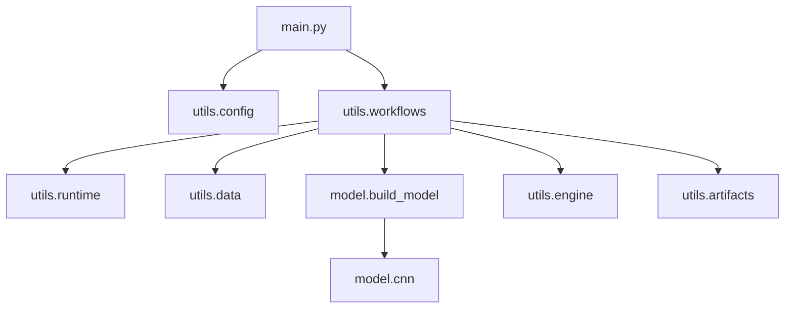

# E_AI リポジトリ設計

## 目的と境界

`E_AI` は CIFAR-10 用の小型 CNN 学習を、少ない依存関係と明確な責務で実行する新規プロジェクトです。
現時点では FP32 の学習・評価・重み出力だけを対象にし、量子化、Observer、重み変換、再開用
checkpoint は含めません。

すべての実行は `main.py` が入口です。作業の切替は CLI のサブコマンドではなく
`config.json` の `run.mode` に追加します。`main.py` 自体は設定を読み、対応する workflow を選ぶだけに保ちます。

## 現在の構成

```text
E_AI/
├── main.py                 # config を読み、run.mode の workflow を選択
├── config.json             # 現在の学習設定
├── pyproject.toml          # 実行依存関係
├── README.md
├── model/
│   ├── __init__.py         # 明示的なモデル factory
│   └── cnn.py              # TinyCifarCNN
├── utils/
│   ├── __init__.py         # pretty_errors の有効化
│   ├── artifacts.py        # log、曲線、重みの保存
│   ├── config.py           # JSON の読込み・検証・dataclass 化
│   ├── data.py             # CIFAR-10 transform / DataLoader
│   ├── display.py          # Rich による開始時の表示
│   ├── engine.py           # 1 epoch の train / evaluate
│   ├── runtime.py          # seed と device の選択
│   └── workflows.py        # 学習の組立て
├── tools/                  # 将来の Observer・重み変換用（現在は空）
└── docs/
    └── repository_design.md
```

`model/` は `utils/` と `tools/` を import しません。`utils/engine.py` は任意の
`nn.Module` を受け取るため、モデル名や保存先を知りません。`utils/workflows.py` だけが
model、data、engine、保存 utility を組み合わせます。



## 実行と設定

現在の `run.mode` は `train` だけです。`run.log_dir` は run ごとの成果物を作る親ディレクトリです。
同じ秒に複数回開始した場合は `_01`、`_02` のような接尾辞で衝突を避けます。

| 設定 | 現在の値・許可値 | 用途 |
| --- | --- | --- |
| `run.mode` | `train` | `main.py` が選ぶ workflow |
| `run.seed` | 整数 | 乱数 seed |
| `run.device` | `auto` / `cpu` / `cuda` | 実行 device |
| `run.log_dir` | 空でない文字列 | timestamped run directory の親 |
| `data.dataset` | `cifar10` | 対象データセット |
| `data.image_size` | `32` / `256` | CIFAR-10 画像サイズ |
| `data.normalization` | `cifar10` / `zero_one` | 入力正規化 |
| `model.name` | `cifar_cnn` | factory が作るモデル |
| `model.num_classes` | `10` | CIFAR-10 のクラス数 |

`cifar10` は CIFAR-10 の mean/std で標準化し、`zero_one` は `ToTensor()` 後の `[0, 1]`
をそのままモデルに渡します。どちらも学習重みの入力契約なので、出力された `config.json` に保存します。

## 成果物の契約

`utils/artifacts.py` が `log/YYYYMMDD_HHMMSS/` に次を保存します。

| ファイル | 内容 |
| --- | --- |
| `config.json` | 検証済みの実効設定 |
| `training_info.json` | device、PyTorch 版、モデル・入力の基本情報 |
| `training.log` | 開始時の情報と epoch ごとの結果 |
| `metrics.jsonl` | epoch ごとの loss/accuracy。後処理しやすい JSON Lines 形式 |
| `curves.png` | train/test の loss と accuracy 曲線 |
| `model_best.pth` | 最大 test accuracy を更新したモデルの raw `state_dict` |
| `model_final.pth` | 最終 epoch の raw `state_dict` |

`model_best.pth` と `model_final.pth` は optimizer、epoch、乱数状態を含まないため、
学習再開には使いません。再開が必要になった時点でのみ、別の明示的な
`tools/checkpoint.py` と互換性仕様を追加します。

## 今後の拡張ルール

- 量子化層と量子化 policy は `model/` に置く。
- Observer、重み変換、完全な checkpoint は `tools/` に置く。
- 新しい mode は `utils/workflows.py` に追加し、`main.py` の `WORKFLOWS` に登録する。
- テストを導入する場合は root の `tests/` に置き、実行時に import される `utils/` には置かない。
- 新たな保存形式を導入する前に、ファイル名、必要な metadata、読み込み互換性を docs に固定する。
